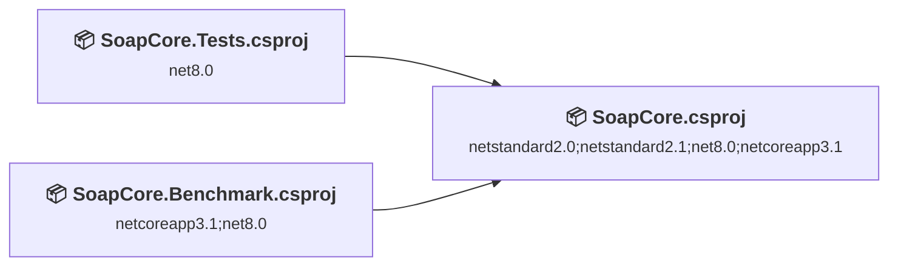
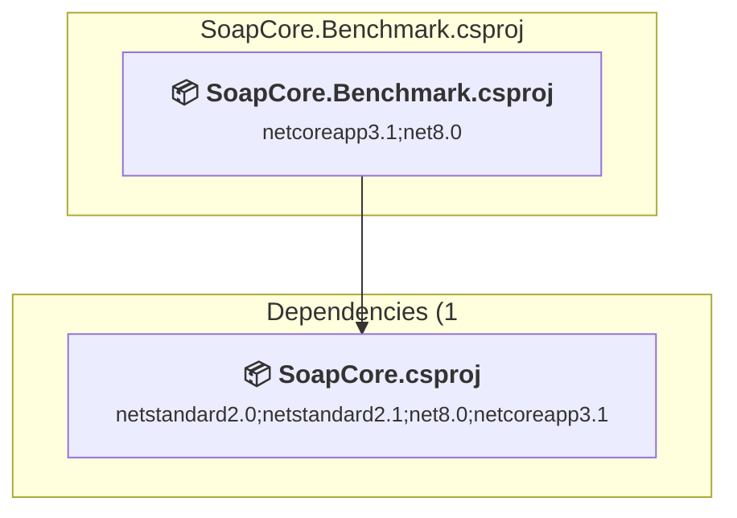
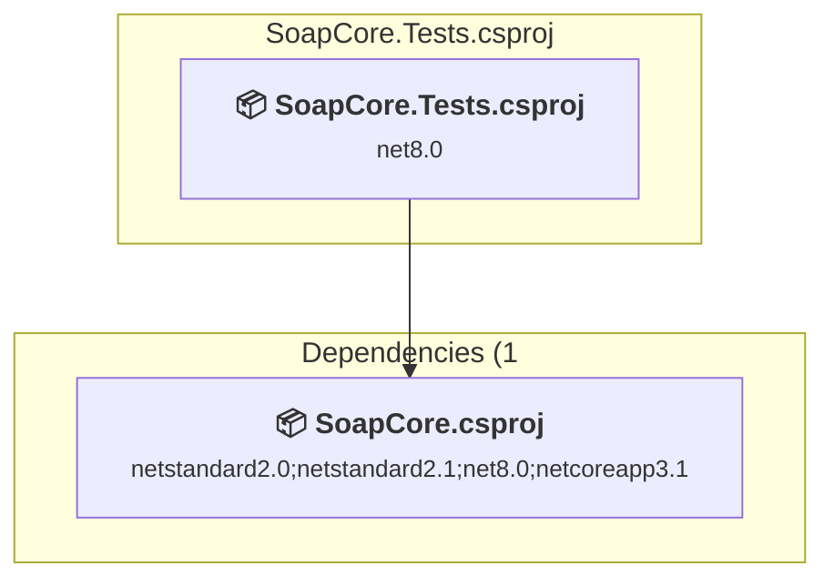
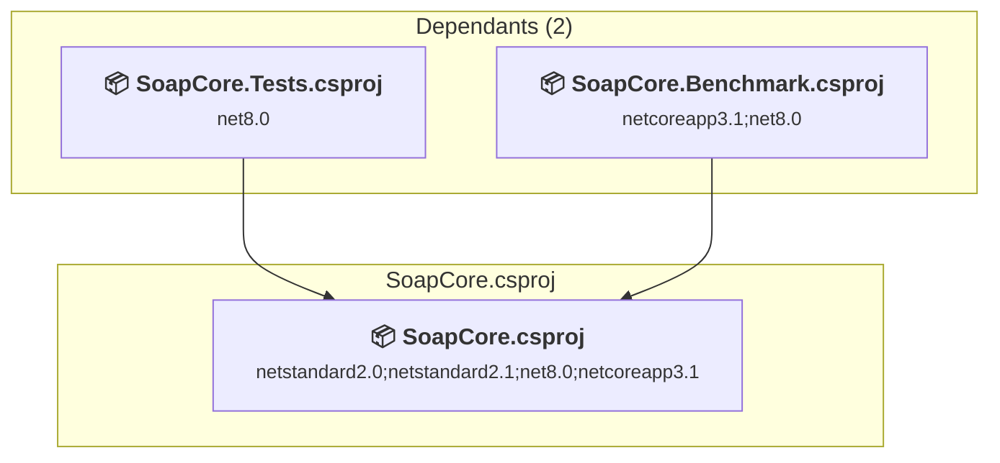

# Projects and dependencies analysis

This document provides a comprehensive overview of the projects and their dependencies in the context of upgrading to .NETCoreApp,Version=v10.0.

## Table of Contents

- [Executive Summary](#executive-Summary)
  - [Highlevel Metrics](#highlevel-metrics)
  - [Projects Compatibility](#projects-compatibility)
  - [Package Compatibility](#package-compatibility)
  - [API Compatibility](#api-compatibility)
  - [Binding Redirect Configuration](#binding-redirect-configuration)
- [Aggregate NuGet packages details](#aggregate-nuget-packages-details)
- [Top API Migration Challenges](#top-api-migration-challenges)
  - [Technologies and Features](#technologies-and-features)
  - [Most Frequent API Issues](#most-frequent-api-issues)
- [Projects Relationship Graph](#projects-relationship-graph)
- [Project Details](#project-details)

  - [SoapCore.Benchmark\SoapCore.Benchmark.csproj](#soapcorebenchmarksoapcorebenchmarkcsproj)
  - [SoapCore.Tests\SoapCore.Tests.csproj](#soapcoretestssoapcoretestscsproj)
  - [SoapCore\SoapCore.csproj](#soapcoresoapcorecsproj)

## Executive Summary

### Highlevel Metrics

| Metric | Count | Status |
| :--- | :---: | :--- |
| Total Projects | 3 | All require upgrade |
| Total NuGet Packages | 22 | 10 need upgrade |
| Total Code Files | 305 |  |
| Total Code Files with Incidents | 177 |  |
| Total Lines of Code | 26204 |  |
| Total Number of Issues | 2288 |  |
| Estimated LOC to modify | 2274+ | at least 8,7% of codebase |

### Projects Compatibility

| Project | Target Framework | Difficulty | Package Issues | API Issues | Binding Issues | Est. LOC Impact | Description |
| :--- | :---: | :---: | :---: | :---: | :---: | :---: | :--- |
| [SoapCore.Benchmark\SoapCore.Benchmark.csproj](#soapcorebenchmarksoapcorebenchmarkcsproj) | netcoreapp3.1;net8.0 | 🟢 Low | 1 | 9 | 0 | 9+ | DotNetCoreApp, Sdk Style = True |
| [SoapCore.Tests\SoapCore.Tests.csproj](#soapcoretestssoapcoretestscsproj) | net8.0 | 🟢 Low | 7 | 1586 | 0 | 1586+ | DotNetCoreApp, Sdk Style = True |
| [SoapCore\SoapCore.csproj](#soapcoresoapcorecsproj) | netstandard2.0;netstandard2.1;net8.0;netcoreapp3.1 | 🟢 Low | 3 | 679 | 0 | 679+ | ClassLibrary, Sdk Style = True |

### Package Compatibility

| Status | Count | Percentage |
| :--- | :---: | :---: |
| ✅ Compatible | 12 | 54,5% |
| ⚠️ Incompatible | 2 | 9,1% |
| 🔄 Upgrade Recommended | 8 | 36,4% |
| ***Total NuGet Packages*** | ***22*** | ***100%*** |

### API Compatibility

| Category | Count | Impact |
| :--- | :---: | :--- |
| 🔴 Binary Incompatible | 7 | High - Require code changes |
| 🟡 Source Incompatible | 2134 | Medium - Needs re-compilation and potential conflicting API error fixing |
| 🔵 Behavioral change | 133 | Low - Behavioral changes that may require testing at runtime |
| ✅ Compatible | 24868 |  |
| ***Total APIs Analyzed*** | ***27142*** |  |

## Aggregate NuGet packages details

| Package | Current Version | Suggested Version | Projects | Description |
| :--- | :---: | :---: | :--- | :--- |
| BenchmarkDotNet | 0.14.0 |  | [SoapCore.Benchmark.csproj](#soapcorebenchmarksoapcorebenchmarkcsproj) | ✅Compatible |
| DeepEqual.SuperJMN | 2.0.0 |  | [SoapCore.Tests.csproj](#soapcoretestssoapcoretestscsproj) | ✅Compatible |
| DotNet.ReproducibleBuilds | 1.2.25 |  | [SoapCore.Benchmark.csproj](#soapcorebenchmarksoapcorebenchmarkcsproj) [SoapCore.csproj](#soapcoresoapcorecsproj) [SoapCore.Tests.csproj](#soapcoretestssoapcoretestscsproj) | ✅Compatible |
| Microsoft.AspNetCore.Authentication.JwtBearer | 8.0.13 | 10.0.8 | [SoapCore.Tests.csproj](#soapcoretestssoapcoretestscsproj) | NuGet package upgrade is recommended |
| Microsoft.AspNetCore.Connections.Abstractions | 9.0.2 | 10.0.8 | [SoapCore.csproj](#soapcoresoapcorecsproj) | NuGet package upgrade is recommended |
| Microsoft.AspNetCore.Mvc.Core | 2.3.0 |  | [SoapCore.csproj](#soapcoresoapcorecsproj) | ✅Compatible |
| Microsoft.AspNetCore.TestHost | 8.0.13 | 10.0.8 | [SoapCore.Benchmark.csproj](#soapcorebenchmarksoapcorebenchmarkcsproj) [SoapCore.Tests.csproj](#soapcoretestssoapcoretestscsproj) | NuGet package upgrade is recommended |
| Microsoft.Extensions.Hosting | 9.0.2 | 10.0.8 | [SoapCore.Tests.csproj](#soapcoretestssoapcoretestscsproj) | NuGet package upgrade is recommended |
| Microsoft.NET.Test.Sdk | 17.13.0 |  | [SoapCore.Tests.csproj](#soapcoretestssoapcoretestscsproj) | ✅Compatible |
| Moq | 4.20.72 |  | [SoapCore.Tests.csproj](#soapcoretestssoapcoretestscsproj) | ✅Compatible |
| MSTest.TestAdapter | 3.8.2 |  | [SoapCore.Tests.csproj](#soapcoretestssoapcoretestscsproj) | ✅Compatible |
| MSTest.TestFramework | 3.8.2 |  | [SoapCore.Tests.csproj](#soapcoretestssoapcoretestscsproj) | ✅Compatible |
| Shouldly | 4.3.0 |  | [SoapCore.Tests.csproj](#soapcoretestssoapcoretestscsproj) | ✅Compatible |
| StyleCop.Analyzers | 1.1.118 |  | [SoapCore.csproj](#soapcoresoapcorecsproj) [SoapCore.Tests.csproj](#soapcoretestssoapcoretestscsproj) | ✅Compatible |
| System.CodeDom | 9.0.2 | 10.0.8 | [SoapCore.csproj](#soapcoresoapcorecsproj) | NuGet package upgrade is recommended |
| System.Formats.Asn1 | 9.0.2 | 10.0.8 | [SoapCore.Tests.csproj](#soapcoretestssoapcoretestscsproj) | NuGet package upgrade is recommended |
| System.Security.Cryptography.Pkcs | 9.0.2 | 10.0.8 | [SoapCore.Tests.csproj](#soapcoretestssoapcoretestscsproj) | NuGet package upgrade is recommended |
| System.ServiceModel.Http | 8.1.1 |  | [SoapCore.csproj](#soapcoresoapcorecsproj) | ✅Compatible |
| System.Text.Json | 9.0.2 | 10.0.8 | [SoapCore.csproj](#soapcoresoapcorecsproj) | NuGet package upgrade is recommended |
| xunit | 2.9.3 |  | [SoapCore.Tests.csproj](#soapcoretestssoapcoretestscsproj) | ⚠️NuGet package is deprecated |
| xunit.runner.console | 2.9.3 |  | [SoapCore.Tests.csproj](#soapcoretestssoapcoretestscsproj) | ⚠️NuGet package is deprecated |
| xunit.runner.visualstudio | 3.0.2 |  | [SoapCore.Tests.csproj](#soapcoretestssoapcoretestscsproj) | ✅Compatible |

## Top API Migration Challenges

### Technologies and Features

| Technology | Issues | Percentage | Migration Path |
| :--- | :---: | :---: | :--- |
| WCF Client APIs | 1995 | 87,7% | WCF client-side APIs for building service clients that communicate with WCF services. These APIs are available as exact equivalents via NuGet packages - add System.ServiceModel.* NuGet packages (System.ServiceModel.Http, System.ServiceModel.Primitives, System.ServiceModel.NetTcp, etc.) |
| CodeDom & Dynamic Code Generation | 5 | 0,2% | Runtime code generation, compilation, and scripting APIs including CodeDom and JScript that have limited support in .NET Core/.NET. These were used for dynamic code generation but are largely obsolete. Consider Roslyn APIs for code generation or alternative scripting solutions. |
| IdentityModel & Claims-based Security | 5 | 0,2% | Windows Identity Foundation (WIF), SAML, and claims-based authentication APIs that have been replaced by modern identity libraries. WIF was the original identity framework for .NET Framework. Migrate to Microsoft.IdentityModel.* packages (modern identity stack). |

### Most Frequent API Issues

| API | Count | Percentage | Category |
| :--- | :---: | :---: | :--- |
| T:System.ServiceModel.Channels.MessageVersion | 196 | 8,6% | Source Incompatible |
| T:System.ServiceModel.OperationContractAttribute | 192 | 8,4% | Source Incompatible |
| M:System.ServiceModel.OperationContractAttribute.#ctor | 190 | 8,4% | Source Incompatible |
| T:System.ServiceModel.Channels.Message | 124 | 5,5% | Source Incompatible |
| T:Microsoft.AspNetCore.Hosting.IWebHost | 85 | 3,7% | Source Incompatible |
| T:System.ServiceModel.ServiceContractAttribute | 82 | 3,6% | Source Incompatible |
| M:System.ServiceModel.ServiceContractAttribute.#ctor | 80 | 3,5% | Source Incompatible |
| T:System.Net.Http.HttpContent | 70 | 3,1% | Behavioral Change |
| T:System.ServiceModel.MessageBodyMemberAttribute | 65 | 2,9% | Source Incompatible |
| T:System.ServiceModel.EnvelopeVersion | 50 | 2,2% | Source Incompatible |
| T:System.ServiceModel.Channels.MessageHeaders | 47 | 2,1% | Source Incompatible |
| M:System.ServiceModel.MessageBodyMemberAttribute.#ctor | 44 | 1,9% | Source Incompatible |
| T:System.ServiceModel.MessageContractAttribute | 39 | 1,7% | Source Incompatible |
| T:System.ServiceModel.XmlSerializerFormatAttribute | 39 | 1,7% | Source Incompatible |
| M:System.ServiceModel.XmlSerializerFormatAttribute.#ctor | 37 | 1,6% | Source Incompatible |
| T:System.ServiceModel.EndpointAddress | 36 | 1,6% | Source Incompatible |
| T:System.ServiceModel.MessageHeaderAttribute | 35 | 1,5% | Source Incompatible |
| T:System.ServiceModel.Description.ServiceEndpoint | 32 | 1,4% | Source Incompatible |
| M:System.ServiceModel.MessageContractAttribute.#ctor | 31 | 1,4% | Source Incompatible |
| M:System.ServiceModel.MessageHeaderAttribute.#ctor | 26 | 1,1% | Source Incompatible |
| T:System.ServiceModel.Channels.MessageProperties | 25 | 1,1% | Source Incompatible |
| P:System.ServiceModel.Channels.MessageVersion.Envelope | 24 | 1,1% | Source Incompatible |
| T:System.Uri | 24 | 1,1% | Behavioral Change |
| P:System.ServiceModel.Channels.Message.Headers | 23 | 1,0% | Source Incompatible |
| T:Microsoft.AspNetCore.Hosting.WebHostBuilder | 22 | 1,0% | Source Incompatible |
| M:System.Uri.#ctor(System.String) | 18 | 0,8% | Behavioral Change |
| M:System.ServiceModel.EndpointAddress.#ctor(System.Uri,System.ServiceModel.Channels.AddressHeader[]) | 18 | 0,8% | Source Incompatible |
| P:System.ServiceModel.Channels.MessageVersion.Soap11 | 17 | 0,7% | Source Incompatible |
| M:System.TimeSpan.FromHours(System.Double) | 17 | 0,7% | Source Incompatible |
| T:System.Xml.Serialization.XmlSerializer | 16 | 0,7% | Behavioral Change |
| T:System.ServiceModel.BasicHttpBinding | 16 | 0,7% | Source Incompatible |
| M:System.ServiceModel.BasicHttpBinding.#ctor | 15 | 0,7% | Source Incompatible |
| T:System.ServiceModel.Channels.Binding | 15 | 0,7% | Source Incompatible |
| T:System.ServiceModel.ServiceKnownTypeAttribute | 12 | 0,5% | Source Incompatible |
| T:System.ServiceModel.Channels.MessageFault | 12 | 0,5% | Source Incompatible |
| T:System.ServiceModel.FaultCode | 12 | 0,5% | Source Incompatible |
| M:System.ServiceModel.Channels.BodyWriter.#ctor(System.Boolean) | 10 | 0,4% | Source Incompatible |
| M:System.ServiceModel.ServiceKnownTypeAttribute.#ctor(System.Type) | 9 | 0,4% | Source Incompatible |
| T:System.ServiceModel.Description.ClientCredentials | 9 | 0,4% | Source Incompatible |
| T:System.ServiceModel.FaultException | 9 | 0,4% | Source Incompatible |
| T:System.ServiceModel.MessageParameterAttribute | 8 | 0,4% | Source Incompatible |
| P:System.ServiceModel.MessageParameterAttribute.Name | 8 | 0,4% | Source Incompatible |
| P:System.ServiceModel.ServiceKnownTypeAttribute.MethodName | 8 | 0,4% | Source Incompatible |
| P:System.ServiceModel.MessageContractAttribute.IsWrapped | 8 | 0,4% | Source Incompatible |
| M:System.ServiceModel.Channels.Message.#ctor | 8 | 0,4% | Source Incompatible |
| P:System.ServiceModel.Description.ServiceEndpoint.Name | 8 | 0,4% | Source Incompatible |
| P:System.ServiceModel.Channels.MessageVersion.Soap12WSAddressing10 | 8 | 0,4% | Source Incompatible |
| P:System.ServiceModel.Channels.Message.Version | 7 | 0,3% | Source Incompatible |
| P:System.ServiceModel.ServiceKnownTypeAttribute.Type | 7 | 0,3% | Source Incompatible |
| P:System.ServiceModel.MessageContractMemberAttribute.Name | 7 | 0,3% | Source Incompatible |

## Projects Relationship Graph

Legend:
📦 SDK-style project
⚙️ Classic project

## Project Details

### SoapCore.Benchmark\SoapCore.Benchmark.csproj

#### Project Info

- **Current Target Framework:** netcoreapp3.1;net8.0
- **Proposed Target Framework:** netcoreapp3.1;net8.0;net10.0
- **SDK-style**: True
- **Project Kind:** DotNetCoreApp
- **Dependencies**: 1
- **Dependants**: 0
- **Number of Files**: 3
- **Number of Files with Incidents**: 3
- **Lines of Code**: 158
- **Estimated LOC to modify**: 9+ (at least 5,7% of the project)

#### Dependency Graph

Legend:
📦 SDK-style project
⚙️ Classic project

### API Compatibility

| Category | Count | Impact |
| :--- | :---: | :--- |
| 🔴 Binary Incompatible | 0 | High - Require code changes |
| 🟡 Source Incompatible | 7 | Medium - Needs re-compilation and potential conflicting API error fixing |
| 🔵 Behavioral change | 2 | Low - Behavioral changes that may require testing at runtime |
| ✅ Compatible | 116 |  |
| ***Total APIs Analyzed*** | ***125*** |  |

#### Project Technologies and Features

| Technology | Issues | Percentage | Migration Path |
| :--- | :---: | :---: | :--- |
| WCF Client APIs | 6 | 66,7% | WCF client-side APIs for building service clients that communicate with WCF services. These APIs are available as exact equivalents via NuGet packages - add System.ServiceModel.* NuGet packages (System.ServiceModel.Http, System.ServiceModel.Primitives, System.ServiceModel.NetTcp, etc.) |

### SoapCore.Tests\SoapCore.Tests.csproj

#### Project Info

- **Current Target Framework:** net8.0
- **Proposed Target Framework:** net10.0
- **SDK-style**: True
- **Project Kind:** DotNetCoreApp
- **Dependencies**: 1
- **Dependants**: 0
- **Number of Files**: 229
- **Number of Files with Incidents**: 142
- **Lines of Code**: 15935
- **Estimated LOC to modify**: 1586+ (at least 10,0% of the project)

#### Dependency Graph

Legend:
📦 SDK-style project
⚙️ Classic project

### API Compatibility

| Category | Count | Impact |
| :--- | :---: | :--- |
| 🔴 Binary Incompatible | 7 | High - Require code changes |
| 🟡 Source Incompatible | 1468 | Medium - Needs re-compilation and potential conflicting API error fixing |
| 🔵 Behavioral change | 111 | Low - Behavioral changes that may require testing at runtime |
| ✅ Compatible | 14474 |  |
| ***Total APIs Analyzed*** | ***16060*** |  |

#### Project Technologies and Features

| Technology | Issues | Percentage | Migration Path |
| :--- | :---: | :---: | :--- |
| IdentityModel & Claims-based Security | 5 | 0,3% | Windows Identity Foundation (WIF), SAML, and claims-based authentication APIs that have been replaced by modern identity libraries. WIF was the original identity framework for .NET Framework. Migrate to Microsoft.IdentityModel.* packages (modern identity stack). |
| WCF Client APIs | 1335 | 84,2% | WCF client-side APIs for building service clients that communicate with WCF services. These APIs are available as exact equivalents via NuGet packages - add System.ServiceModel.* NuGet packages (System.ServiceModel.Http, System.ServiceModel.Primitives, System.ServiceModel.NetTcp, etc.) |

### SoapCore\SoapCore.csproj

#### Project Info

- **Current Target Framework:** netstandard2.0;netstandard2.1;net8.0;netcoreapp3.1
- **Proposed Target Framework:** netstandard2.0;netstandard2.1;net8.0;netcoreapp3.1;net10.0
- **SDK-style**: True
- **Project Kind:** ClassLibrary
- **Dependencies**: 0
- **Dependants**: 2
- **Number of Files**: 75
- **Number of Files with Incidents**: 32
- **Lines of Code**: 10111
- **Estimated LOC to modify**: 679+ (at least 6,7% of the project)

#### Dependency Graph

Legend:
📦 SDK-style project
⚙️ Classic project

### API Compatibility

| Category | Count | Impact |
| :--- | :---: | :--- |
| 🔴 Binary Incompatible | 0 | High - Require code changes |
| 🟡 Source Incompatible | 659 | Medium - Needs re-compilation and potential conflicting API error fixing |
| 🔵 Behavioral change | 20 | Low - Behavioral changes that may require testing at runtime |
| ✅ Compatible | 10278 |  |
| ***Total APIs Analyzed*** | ***10957*** |  |

#### Project Technologies and Features

| Technology | Issues | Percentage | Migration Path |
| :--- | :---: | :---: | :--- |
| CodeDom & Dynamic Code Generation | 5 | 0,7% | Runtime code generation, compilation, and scripting APIs including CodeDom and JScript that have limited support in .NET Core/.NET. These were used for dynamic code generation but are largely obsolete. Consider Roslyn APIs for code generation or alternative scripting solutions. |
| WCF Client APIs | 654 | 96,3% | WCF client-side APIs for building service clients that communicate with WCF services. These APIs are available as exact equivalents via NuGet packages - add System.ServiceModel.* NuGet packages (System.ServiceModel.Http, System.ServiceModel.Primitives, System.ServiceModel.NetTcp, etc.) |

